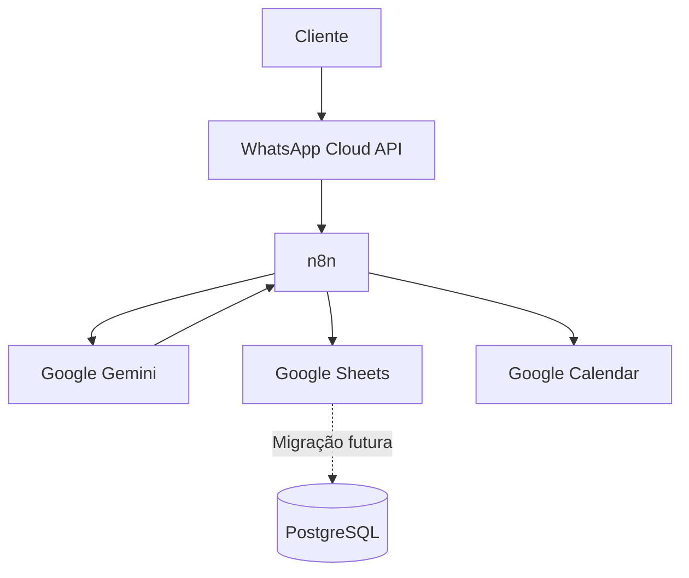
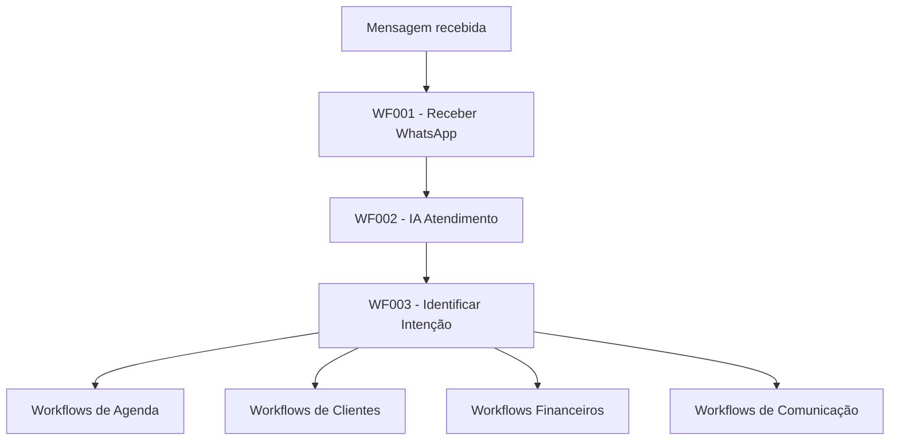
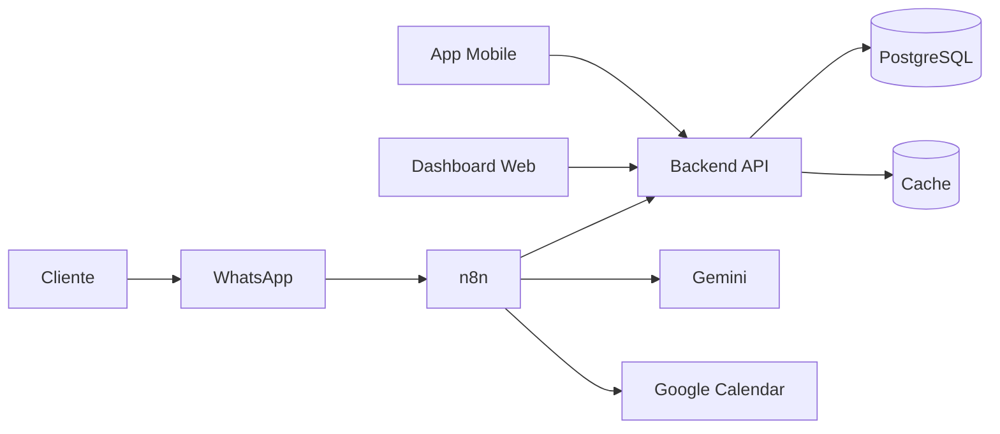

# BeautyFlow AI

<p align="center">
  <strong>Plataforma SaaS de Atendimento Inteligente para Profissionais da Beleza</strong>
</p>

<p align="center">
  Automação de atendimento, agendamentos, comunicação e gestão utilizando WhatsApp, n8n, Google Gemini, Google Calendar e PostgreSQL.
</p>

---

## Status do Projeto


> 🚧 Projeto em desenvolvimento ativo.

---

# Sumário

* [Sobre o Projeto](#sobre-o-projeto)
* [Objetivos](#objetivos)
* [Principais Funcionalidades](#principais-funcionalidades)
* [Arquitetura](#arquitetura)
* [Fluxo Principal](#fluxo-principal)
* [Stack Tecnológica](#stack-tecnológica)
* [Estrutura do Repositório](#estrutura-do-repositório)
* [Workflows n8n](#workflows-n8n)
* [Modelo de Dados](#modelo-de-dados)
* [Integrações](#integrações)
* [Configuração do Ambiente](#configuração-do-ambiente)
* [Variáveis e Credenciais](#variáveis-e-credenciais)
* [Como Executar](#como-executar)
* [Testes](#testes)
* [Segurança](#segurança)
* [Logs e Observabilidade](#logs-e-observabilidade)
* [Padrões de Desenvolvimento](#padrões-de-desenvolvimento)
* [Git e Commits](#git-e-commits)
* [Roadmap](#roadmap)
* [Documentação](#documentação)
* [Contribuição](#contribuição)
* [Licença](#licença)

---

# Sobre o Projeto

O **BeautyFlow AI** é uma plataforma SaaS criada para automatizar o atendimento e a gestão de profissionais e empresas do setor de beleza.

A plataforma utiliza Inteligência Artificial para interpretar mensagens recebidas pelo WhatsApp, identificar intenções, consultar disponibilidade, realizar agendamentos e executar diferentes fluxos administrativos.

O projeto foi concebido inicialmente como um MVP baseado em automações com n8n e integrações cloud, com evolução planejada para uma arquitetura SaaS completa.

## Público-alvo

A solução pode ser utilizada por:

* Nail Designers
* Manicures
* Pedicures
* Lash Designers
* Designers de Sobrancelhas
* Esteticistas
* Cabeleireiros
* Barbearias
* Clínicas de Estética
* Salões de Beleza
* Profissionais autônomos

---

# Objetivos

O BeautyFlow AI tem como objetivos:

* Automatizar o atendimento via WhatsApp.
* Reduzir tarefas manuais.
* Diminuir erros em agendamentos.
* Melhorar a experiência das clientes.
* Disponibilizar atendimento 24 horas.
* Integrar agenda, cadastro, comunicação e financeiro.
* Criar uma base escalável para operação multiempresa.
* Evoluir para uma plataforma SaaS completa.

---

# Principais Funcionalidades

## Atendimento Inteligente

* Recebimento automático de mensagens.
* Identificação de clientes.
* Cadastro automático.
* Interpretação de linguagem natural.
* Identificação da intenção da cliente.
* Respostas personalizadas utilizando IA.
* Registro de mensagens.
* Encaminhamento para fluxos específicos.

---

## Agenda

* Consulta de horários disponíveis.
* Criação de agendamentos.
* Reagendamento.
* Cancelamento.
* Validação de disponibilidade.
* Integração com Google Calendar.
* Prevenção de conflitos de agenda.

---

## Clientes

* Cadastro automático.
* Atualização cadastral.
* Histórico de atendimentos.
* Identificação por telefone.
* Status ativo/inativo.

---

## Comunicação

* Confirmação de agendamento.
* Lembretes automáticos.
* Pesquisa de satisfação.
* Follow-up pós-atendimento.
* Mensagens automáticas pelo WhatsApp.

---

## Financeiro

* Registro de pagamentos.
* Histórico financeiro.
* Cobranças.
* Associação de pagamentos a clientes e agendamentos.

---

## Administração

* Logs.
* Auditoria.
* Backup.
* Limpeza de dados.
* Rotinas administrativas.

---

# Arquitetura

## Arquitetura de Alto Nível



---

# Fluxo Principal



---

# Stack Tecnológica

| Tecnologia         | Finalidade                       |
| ------------------ | -------------------------------- |
| n8n                | Orquestração e automação         |
| Google Gemini      | Inteligência Artificial          |
| WhatsApp Cloud API | Canal de atendimento             |
| Google Calendar    | Agenda                           |
| Google Sheets      | Persistência temporária do MVP   |
| PostgreSQL         | Banco de dados definitivo        |
| Git                | Versionamento                    |
| GitHub             | Repositório e colaboração        |
| JavaScript         | Lógica complementar em workflows |
| SQL                | Estrutura e manipulação do banco |

---

# Estrutura do Repositório

```text
beautyflow-ai/
│
├── arquitetura/
│
├── assets/
│
├── backend/
│
├── database/
│   ├── 01-create-tables.sql
│   ├── 02-indexes.sql
│   ├── 03-constraints.sql
│   ├── 04-triggers.sql
│   └── 05-seed.sql
│
├── docs/
│   ├── 01-visao-do-produto/
│   ├── 02-requisitos-funcionais/
│   ├── 03-requisitos-nao-funcionais/
│   ├── 04-regras-de-negocio/
│   ├── 05-jornada-do-cliente/
│   ├── 06-casos-de-uso/
│   ├── 07-user-stories/
│   ├── 08-product-backlog/
│   ├── 09-arquitetura/
│   ├── 10-modelo-de-dados/
│   └── product-management/
│
├── frontend/
│
├── n8n/
│   ├── workflows/
│   │   ├── atendimento/
│   │   ├── agenda/
│   │   ├── clientes/
│   │   ├── financeiro/
│   │   ├── comunicacao/
│   │   └── administracao/
│   │
│   ├── documentacao/
│   ├── prompts/
│   └── README.md
│
├── tests/
│   ├── Casos-de-Teste/
│   ├── Evidencias/
│   ├── Testes-de-API/
│   ├── Testes-de-Aceitacao/
│   ├── Testes-de-Carga/
│   └── Testes-de-Seguranca/
│
├── CLAUDE.md
├── Roadmap.md
└── README.md
```

---

# Workflows n8n

O projeto utiliza uma convenção de nomenclatura baseada em domínio e identificador.

Formato:

```text
DOMINIO - WFXXX - NOME
```

Exemplo:

```text
ATD - WF001 - Receber WhatsApp
```

---

## Atendimento

| Código | Workflow             |
| ------ | -------------------- |
| WF001  | Receber WhatsApp     |
| WF002  | IA Atendimento       |
| WF003  | Identificar Intenção |

---

## Agenda

| Código | Workflow                  |
| ------ | ------------------------- |
| WF004  | Consultar Disponibilidade |
| WF005  | Criar Agendamento         |
| WF006  | Reagendar                 |
| WF007  | Cancelar                  |

---

## Clientes

| Código | Workflow           |
| ------ | ------------------ |
| WF008  | Cadastrar Cliente  |
| WF009  | Atualizar Cadastro |

---

## Financeiro

| Código | Workflow            |
| ------ | ------------------- |
| WF010  | Registrar Pagamento |
| WF011  | Cobrança            |

---

## Comunicação

| Código | Workflow    |
| ------ | ----------- |
| WF012  | Confirmação |
| WF013  | Lembrete    |
| WF014  | Pesquisa    |
| WF015  | Follow-up   |

---

## Administração

| Código | Workflow |
| ------ | -------- |
| WF016  | Backup   |
| WF017  | Logs     |
| WF018  | Limpeza  |

---

# Modelo de Dados

A arquitetura de dados prevê suporte multiempresa.

## Principais Entidades

```text
EMPRESA
  │
  ├── PROFISSIONAIS
  ├── SERVICOS
  ├── CLIENTES
  │
  └── AGENDAMENTOS
          │
          ├── PAGAMENTOS
          ├── AVALIACOES
          └── NOTIFICACOES
```

Principais entidades:

* Empresas
* Usuários
* Profissionais
* Clientes
* Categorias de Serviço
* Serviços
* Agenda
* Agendamentos
* Lista de Espera
* Pagamentos
* Avaliações
* Notificações
* Configurações
* Planos
* Assinaturas
* Logs de Auditoria

---

# Integrações

## WhatsApp Cloud API

Responsável pelo recebimento e envio de mensagens.

Fluxo:

```text
Cliente
   ↓
WhatsApp
   ↓
Meta
   ↓
Webhook
   ↓
n8n
```

---

## Google Gemini

Utilizado para:

* interpretação de mensagens;
* respostas inteligentes;
* análise de intenção;
* suporte ao atendimento automatizado.

---

## Google Calendar

Utilizado para:

* consulta de horários;
* criação de eventos;
* reagendamento;
* cancelamento;
* controle de conflitos.

---

## Google Sheets

Utilizado atualmente como persistência de dados do MVP.

Principais abas:

* EMPRESA
* PROFISSIONAIS
* CLIENTES
* SERVICOS
* AGENDAMENTOS
* MENSAGENS
* LOGS

A arquitetura prevê migração gradual para PostgreSQL.

---

# Configuração do Ambiente

## Pré-requisitos

Antes de executar o projeto, são necessários:

* Git
* Conta GitHub
* Conta n8n
* Conta Google
* Conta Google Cloud
* Conta Meta Developer
* WhatsApp Cloud API
* API Google Gemini
* PostgreSQL para ambiente futuro

---

# Variáveis e Credenciais

Credenciais nunca devem ser armazenadas diretamente no repositório.

Exemplos de configurações necessárias:

```text
WHATSAPP_ACCESS_TOKEN
WHATSAPP_PHONE_NUMBER_ID
WHATSAPP_VERIFY_TOKEN

GOOGLE_CALENDAR_ID
GOOGLE_CREDENTIALS

GOOGLE_SHEETS_DOCUMENT_ID

GEMINI_API_KEY

DATABASE_URL
```

> Os nomes acima são exemplos conceituais. Credenciais do n8n devem preferencialmente ser configuradas no próprio sistema de Credentials.

---

# Como Executar

## 1. Clonar o repositório

```bash
git clone https://github.com/Kelencs/beautyflow-ai.git
```

---

## 2. Entrar no projeto

```bash
cd beautyflow-ai
```

---

## 3. Configurar o n8n

Configure as credenciais necessárias para:

* WhatsApp Cloud API
* Google Sheets
* Google Calendar
* Google Gemini
* PostgreSQL, quando aplicável

---

## 4. Importar os Workflows

No n8n:

```text
Workflows
→ Import from File
```

Importe os arquivos JSON disponíveis em:

```text
n8n/workflows/
```

---

## 5. Configurar o WhatsApp

Configure na Meta:

* número do WhatsApp;
* Phone Number ID;
* Access Token;
* Webhook;
* Verify Token;
* assinatura dos eventos necessários.

---

## 6. Configurar o Google Calendar

Configure:

* credencial OAuth;
* calendário utilizado;
* timezone;
* permissões;
* formato de datas.

---

## 7. Configurar o Google Sheets

Configure o documento utilizado pelo MVP e valide as abas necessárias.

---

## 8. Configurar o Gemini

Configure a credencial utilizada pelo workflow de IA.

---

## 9. Executar os Testes

Valide inicialmente:

```text
WF001
  ↓
WF002
  ↓
WF003
```

Depois valide individualmente os demais fluxos.

---

# Testes

O projeto possui estrutura dedicada a QA.

```text
tests/
├── Casos-de-Teste/
├── Evidencias/
├── Testes-de-API/
├── Testes-de-Aceitacao/
├── Testes-de-Carga/
└── Testes-de-Seguranca/
```

## Tipos de Testes

### Funcionais

Validam regras de negócio e funcionalidades.

### Integração

Validam:

* n8n ↔ WhatsApp
* n8n ↔ Gemini
* n8n ↔ Google Sheets
* n8n ↔ Google Calendar
* n8n ↔ PostgreSQL

### Aceitação

Validam os fluxos do ponto de vista da cliente e do negócio.

### Segurança

Validam exposição de dados, credenciais e acessos.

### Carga

Planejados para validar escalabilidade.

---

# Segurança

## Regras Gerais

Nunca versionar:

* tokens;
* senhas;
* API Keys;
* credenciais OAuth;
* arquivos de credenciais;
* dados pessoais reais.

---

## Princípios

O projeto deve seguir:

* menor privilégio;
* separação de credenciais;
* comunicação HTTPS;
* controle de acesso;
* rastreabilidade;
* validação de entrada;
* proteção de dados;
* segregação multiempresa.

---

## LGPD

A arquitetura deve considerar a Lei Geral de Proteção de Dados.

Pontos importantes:

* coleta mínima de informações;
* finalidade de tratamento;
* segurança;
* exclusão quando aplicável;
* controle de acesso;
* rastreabilidade;
* proteção de dados pessoais.

---

# Logs e Observabilidade

O projeto possui um workflow administrativo dedicado a logs:

```text
ADM - WF017 - Logs
```

Informações recomendadas:

```text
ID_LOG
ID_EMPRESA
WORKFLOW
NODE
TIPO
MENSAGEM
DATA_HORA
EXECUTION_ID
```

Nunca registrar:

* API Keys;
* senhas;
* tokens;
* informações sensíveis desnecessárias.

---

# Padrões de Desenvolvimento

## Workflows

Utilizar:

```text
DOMINIO - WFXXX - Nome
```

Exemplos:

```text
ATD - WF001 - Receber WhatsApp
AGE - WF005 - Criar Agendamento
CLI - WF008 - Cadastro Cliente
```

---

## Nodes

Utilizar nomes descritivos.

Evitar:

```text
IF1
HTTP1
Set1
Code2
```

Preferir:

```text
IF - Cliente Existe
GS - Buscar Cliente
GC - Buscar Eventos
CODE - Normalizar Mensagem
```

---

## Arquivos

Utilizar nomes em minúsculo quando aplicável.

Exemplo:

```text
ATD-WF001-receber-whatsapp.json
```

---

# Git e Commits

## Branches

Sugestão:

```text
main
develop
feature/*
fix/*
docs/*
```

Exemplos:

```text
feature/wf005-agendamento
fix/wf002-gemini
docs/readme-principal
```

---

## Conventional Commits

Preferir o padrão:

```text
tipo: descrição
```

Tipos recomendados:

```text
feat
fix
docs
refactor
test
chore
```

Exemplos:

```text
feat: adiciona workflow de cancelamento

fix: corrige busca de cliente no WF002

docs: atualiza documentação do WF008

refactor: simplifica validação de disponibilidade

test: adiciona cenários de reagendamento
```

---

# Roadmap

## Fase 1 — MVP

* [x] Estrutura inicial do projeto
* [x] Documentação funcional
* [x] Estrutura de workflows
* [x] Integração inicial WhatsApp
* [x] Google Sheets
* [x] Google Calendar
* [x] Gemini
* [ ] Finalizar WF001–WF018
* [ ] Executar testes integrados
* [ ] Validar MVP completo

---

## Fase 2 — Banco de Dados

* [ ] Finalizar PostgreSQL
* [ ] Criar índices
* [ ] Criar constraints
* [ ] Criar triggers
* [ ] Criar seeds
* [ ] Migrar Google Sheets
* [ ] Validar compatibilidade

---

## Fase 3 — Plataforma SaaS

* [ ] Backend
* [ ] Autenticação
* [ ] Multiempresa
* [ ] Multiusuário
* [ ] Controle de planos
* [ ] Assinaturas
* [ ] API REST
* [ ] Dashboard administrativo

---

## Fase 4 — Evolução

* [ ] Dashboard financeiro
* [ ] CRM
* [ ] Relatórios
* [ ] BI
* [ ] Métricas operacionais
* [ ] IA para recomendações
* [ ] IA preditiva
* [ ] Lista de espera inteligente
* [ ] Aplicativo mobile
* [ ] Pagamentos Pix

---

# Documentação

Toda a documentação técnica e funcional encontra-se em:

```text
docs/
```

Principais documentos:

```text
01-visao-do-produto
02-requisitos-funcionais
03-requisitos-nao-funcionais
04-regras-de-negocio
05-jornada-do-cliente
06-casos-de-uso
07-user-stories
08-product-backlog
09-arquitetura
10-modelo-de-dados
```

Para regras específicas destinadas a ferramentas de desenvolvimento assistido por IA, consultar:

```text
CLAUDE.md
```

---

# Arquitetura Futura



---

# Visão SaaS

O BeautyFlow AI foi projetado para evoluir para uma arquitetura multiempresa.

Cada empresa deverá possuir seus próprios:

* profissionais;
* clientes;
* serviços;
* agendas;
* configurações;
* planos;
* mensagens;
* pagamentos;
* relatórios.

A segregação deverá ocorrer principalmente através de:

```text
ID_EMPRESA
```

---

# Métricas Futuras

Indicadores planejados:

* quantidade de atendimentos;
* taxa de conversão;
* novos clientes;
* clientes recorrentes;
* cancelamentos;
* no-show;
* faturamento;
* ticket médio;
* horários mais procurados;
* serviços mais vendidos;
* profissionais mais demandados;
* taxa de resposta automática;
* satisfação das clientes.

---

# Contribuição

Fluxo recomendado:

1. Crie uma nova branch.
2. Faça as alterações.
3. Valide dependências.
4. Execute os testes.
5. Atualize documentação quando necessário.
6. Faça commit.
7. Faça push.
8. Abra um Pull Request.

---

# Pull Request

Todo PR deve informar:

* objetivo;
* arquivos alterados;
* workflows impactados;
* integrações afetadas;
* testes realizados;
* riscos;
* evidências quando necessário.

---

# Princípios do Projeto

O BeautyFlow AI prioriza:

> Automação com simplicidade.

> Experiência da cliente.

> Segurança por padrão.

> Arquitetura escalável.

> Documentação como parte do produto.

> Workflows desacoplados.

> Integrações rastreáveis.

> Evolução incremental.

---

# Licença

Este projeto é proprietário.

Todos os direitos são reservados aos mantenedores do **BeautyFlow AI**.

Não é permitida distribuição, utilização comercial ou reprodução sem autorização.

---

# BeautyFlow AI

**Plataforma SaaS de Atendimento Inteligente para Profissionais da Beleza**

```text
WhatsApp + IA + Automação + Agenda + Gestão
```

---

<p align="center">
  <strong>BeautyFlow AI</strong><br>
  Transformando atendimento em automação inteligente.
</p>
