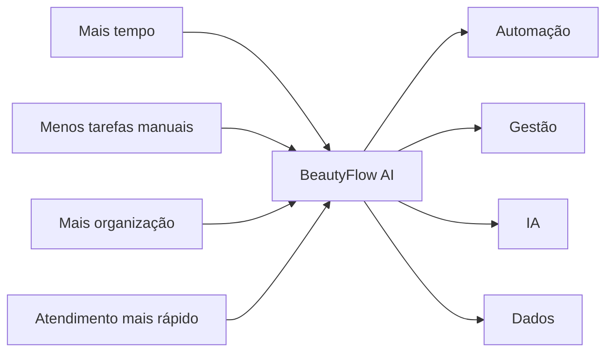
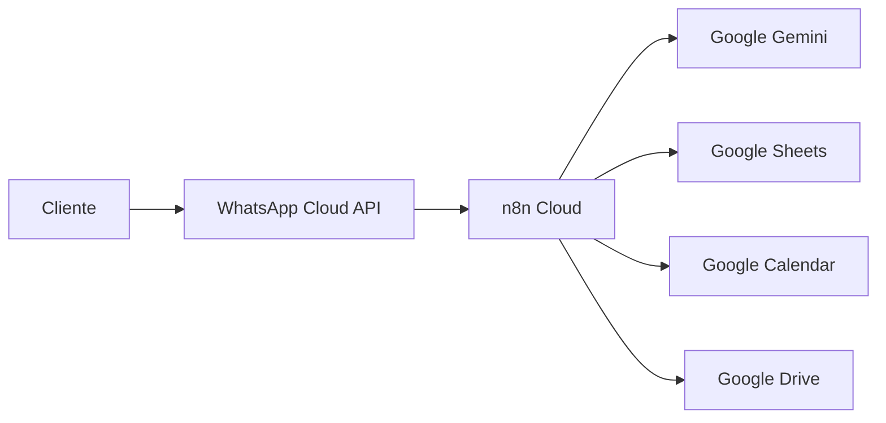
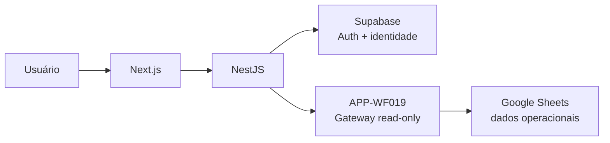
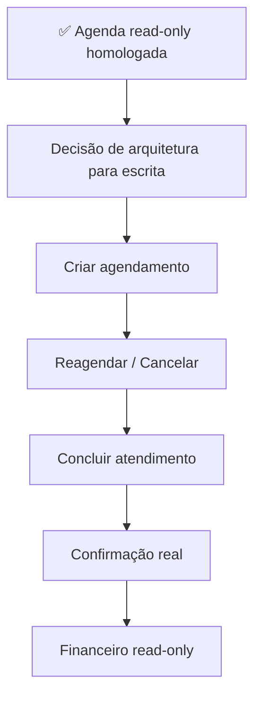

<div align="center">

# ✦ BEAUTYFLOW AI

### Automação inteligente + SaaS + IA para o setor da beleza

**Atendimento • Agenda • Clientes • Financeiro • Comunicação • Inteligência Artificial**

<br/>


<br/>


<br/>

> **Do atendimento no WhatsApp à gestão completa do negócio.**

</div>

---

## 01 // VISÃO DO PRODUTO

O **BeautyFlow AI** é uma plataforma em desenvolvimento para automatizar e organizar a operação de profissionais e empresas do setor da beleza.

A solução combina **Inteligência Artificial, automação de processos e um aplicativo web de gestão**, conectando atendimento, agenda, clientes, profissionais, serviços, financeiro e comunicação em uma arquitetura evolutiva.

O projeto nasceu de um problema recorrente no setor: grande parte da operação acontece manualmente pelo WhatsApp, gerando retrabalho, demora, risco de erros, perda de oportunidades e dificuldade para escalar.

O BeautyFlow transforma essas interações em **processos estruturados, rastreáveis e automatizados**.

---

## 02 // IDENTIDADE DO PROJETO

```ts
const beautyFlow = {
  nome: "BeautyFlow AI",
  produto: [
    "SaaS",
    "Automação de Processos",
    "Inteligência Artificial",
    "Gestão para o setor da beleza"
  ],
  objetivo: [
    "Automatizar atendimento no WhatsApp",
    "Organizar agenda e disponibilidade",
    "Centralizar clientes, serviços e profissionais",
    "Apoiar processos financeiros",
    "Automatizar comunicação e follow-up",
    "Evoluir para uma plataforma SaaS de gestão"
  ],
  statusAtual: "Em desenvolvimento ativo com integração real read-only homologada",
  checkpoint: "a723bff",
  wf019: "v1.12 — 6 operações homologadas",
  agenda: "Leitura real homologada; escrita ainda pendente",
  proximaEtapa: "Desenhar a Agenda operacional de escrita em checkpoints separados"
};
```

---

## 03 // PROPOSTA DE VALOR



### O BeautyFlow busca entregar

- menos tarefas operacionais repetitivas;
- atendimento mais rápido;
- agenda organizada;
- comunicação padronizada;
- redução de esquecimentos;
- visão centralizada da operação;
- base para decisões orientadas por dados;
- estrutura preparada para evolução como SaaS.

---

## 04 // ARQUITETURA ATUAL

### Núcleo operacional



### BeautyFlow App



> O frontend nunca chama o n8n diretamente. O NestJS permanece como backend principal e fronteira de autenticação, autorização, resolução de tenant, regras de negócio e composição de dados. O APP-WF019 atua como **gateway/adaptador**.

---

## 05 // MAPA DOS WORKFLOWS

| Domínio | Workflows | Responsabilidade |
|---|---|---|
| 💬 Atendimento | WF001–WF003 | Recepção, IA e intenção |
| 📅 Agenda | WF004–WF007 | Disponibilidade, agendamento, reagendamento e cancelamento |
| 👤 Clientes | WF008–WF009 | Cadastro e atualização |
| 💳 Financeiro | WF010–WF011 | Pagamentos e cobranças |
| 📣 Comunicação | WF012–WF015 | Mensagens, lembretes, pesquisa e follow-up |
| ⚙️ Administração | WF016–WF018 | Backup, logs e limpeza |
| 🧩 App | WF019 | Gateway read-only entre NestJS e dados operacionais |

WF001–WF018 continuam preservados. A evolução do App não depende de modificar os workflows legados a cada integração read-only.

---

## 06 // APP-WF019 — ESTADO REAL

O `APP-WF019` está atualmente na **v1.12**, com 6 operações read-only homologadas:

| Operação | Fonte | Estado |
|---|---|---|
| `clientes.listar` | CLIENTES | ✅ Homologada |
| `servicos.listar` | SERVICOS | ✅ Homologada |
| `profissionais.listar` | PROFISSIONAIS | ✅ Homologada |
| `empresa.obter` | EMPRESAS | ✅ Homologada |
| `disponibilidades.listar` | DISPONIBILIDADES | ✅ Homologada |
| `agendamentos.listar` | AGENDAMENTOS | ✅ Homologada |

Características do gateway:

- POST + Header Auth;
- `X-BeautyFlow-Gateway-Key`;
- `responseMode=responseNode`;
- envelope `{ok,data,error,meta.requestId}`;
- filtro `ID_EMPRESA` na fonte;
- sem exposição de tenant ou segredos;
- sem fallback silencioso para mock;
- sem `Merge` para convergência de branches mutuamente exclusivos;
- JSON versionado com `active:false`.

---

## 07 // TELAS COM DADOS REAIS

| Tela | Fonte | Situação |
|---|---|---|
| `/clientes` | APP-WF019 → CLIENTES | ✅ Homologada |
| `/servicos` | APP-WF019 → SERVICOS | ✅ Homologada |
| `/profissionais` | APP-WF019 → PROFISSIONAIS | ✅ Homologada |
| `/configuracoes` | EMPRESAS + DISPONIBILIDADES + ProfissionaisService | ✅ Homologada |
| `/agenda` | AGENDAMENTOS + joins NestJS | ✅ Homologada em leitura |
| `/financeiro` | Mock/estrutura | ⏳ Integração real pendente |
| `/comunicacao` | Mock/estrutura | ⏳ Integração real pendente |
| `/ia` | Mock/parcial | ⏳ Integração real pendente |

### Agenda real

A homologação da Agenda validou:

- visão **Hoje** com estado vazio válido;
- visão **Semana** com registros reais;
- visão **Mês** com 6 agendamentos reais em agosto/2026;
- setembro/2026 vazio sem erro;
- detalhes com Cliente + Profissional + Serviço resolvidos pelo NestJS;
- data, horário e valor reais;
- status reais da fonte;
- ausência de confirmação representada por `—`.

Exemplo validado:

```text
Mariana Teste
Beatriz Rocha
Manicure Tradicional
05/08/2026
14:00–16:00
R$ 180,00
AGENDADO
Confirmação: —
```

---

## 08 // MODELO DE STATUS DA AGENDA

O domínio foi separado em dois eixos.

```ts
type StatusAgendamento =
  | 'AGENDADO'
  | 'CONCLUIDO'
  | 'CANCELADO';

type StatusConfirmacao =
  | 'PENDENTE'
  | 'CONFIRMADO';
```

`AgendaItem` contém:

```ts
status: StatusAgendamento;
statusConfirmacao: StatusConfirmacao | null;
```

A fonte real homologada sustenta:

```text
AGENDADO
CONCLUIDO
CANCELADO
```

Para dados reais, enquanto não existir fonte explícita de confirmação:

```text
statusConfirmacao = null
```

Nunca inferir:

```text
AGENDADO → PENDENTE
AGENDADO → CONFIRMADO
horário passado → CONCLUIDO
pagamento → CONCLUIDO
lembrete enviado → CONFIRMADO
```

---

## 09 // JOIN DA AGENDA NO NESTJS

O WF019 devolve somente IDs e dados operacionais mínimos.

```text
agendamentos.listar
        ↓
NestJS
        ├── ClientesService
        ├── ProfissionaisService
        └── ServicosService
        ↓
AgendaItem público
```

O backend resolve:

```text
idCliente      → nome + telefone
idProfissional → nome
idServico      → nome
```

Referências inexistentes geram erro controlado. O sistema não inventa nomes para esconder inconsistência da fonte.

---

## 10 // FLAGS DE FONTE

```env
DATA_SOURCE_CLIENTES=mock|n8n
DATA_SOURCE_SERVICOS=mock|n8n
DATA_SOURCE_PROFISSIONAIS=mock|n8n
DATA_SOURCE_CONFIGURACOES=mock|n8n
DATA_SOURCE_AGENDA=mock|n8n
```

Default seguro: `mock`.

Em modo `n8n`, uma falha real não cai silenciosamente para mock.

---

## 11 // STACK TECNOLÓGICA

### Desenvolvimento


### Dados e autenticação


### IA e automação


---

## 12 // SEGURANÇA E MULTI-TENANCY

O App segue estes princípios:

- autenticação via Supabase;
- `idEmpresa` resolvido server-side;
- browser sem escolha livre do tenant;
- filtro por `ID_EMPRESA` no gateway;
- `platform_admin` sem tenant explícito não recebe visão cross-tenant;
- profissionais preservam restrição ao próprio contexto quando aplicável;
- frontend sem chamada direta ao n8n;
- credenciais e segredos reais fora do repositório;
- respostas minimizadas;
- falhas de integração sem mock silencioso.

---

## 13 // QUALIDADE ATUAL

Checkpoint funcional atual:

```text
a723bff
feat: integrate real agenda through APP-WF019
```

Validações registradas:

```text
469 testes
20 suítes
469/469 verdes
backend lint ✅
frontend lint ✅
shared-types build ✅
backend build ✅
frontend build ✅
WF001–WF018 intactos ✅
segredos no diff: nenhum ✅
```

Não há atualmente GitHub Actions associados ao checkpoint; a validação foi executada localmente antes do push.

---

## 14 // HOMOLOGAÇÃO × JSON VERSIONADO

O JSON versionado do WF019 aponta para `BEAUTYFLOW3.1`.

Durante homologação, os 6 nodes Google Sheets são reapontados manualmente no n8n Cloud para `BEAUTYFLOW_HOMOLOGACAO`.

Após reimportar o JSON, revisar novamente:

```text
GS - Buscar Clientes
GS - Buscar Serviços
GS - Buscar Profissionais
GS - Buscar Empresa
GS - Buscar Disponibilidades
GS - Buscar Agendamentos
```

A fonte de verdade continua sendo o JSON versionado no repositório.

---

## 15 // DÍVIDAS PRESERVADAS

### Agenda

A Agenda está **operacional em leitura**, mas escrita real ainda não foi implementada pelo App:

- criar;
- editar;
- reagendar;
- cancelar;
- concluir;
- persistir confirmação real do cliente.

O Google Calendar legado de WF004–WF007 também permanece fora deste checkpoint.

### Financeiro

A leitura real exige composição entre `AGENDAMENTOS` e `PAGAMENTOS` e decisões adicionais de domínio.

### Comunicação

A integração real precisa consolidar múltiplas fontes e correlações.

### IA

`IA_MEMORIA` não possui writer conhecido em WF001–WF018; não deve haver afirmação de memória persistente real sem fonte confiável.

### Engenharia

- monitorar latência/timeout do gateway;
- avaliar no futuro a ordem validação × filtro por período em `agendamentos.listar`;
- hardening adicional de data/hora;
- observabilidade e preparação para produção.

---

## 16 // ROADMAP IMEDIATO



Recomendação atual: **completar a Agenda operacional antes de abrir um novo módulo**, em checkpoints pequenos, testáveis e homologáveis.

---

## 17 // ESTRUTURA DO REPOSITÓRIO

```text
beautyflow-ai/
├── backend/
├── frontend/
├── libs/
│   └── shared-types/
├── n8n/
│   ├── workflows/
│   │   ├── atendimento/
│   │   ├── agenda/
│   │   ├── clientes/
│   │   ├── financeiro/
│   │   ├── comunicacao/
│   │   ├── administracao/
│   │   └── app/
│   │       └── APP-WF019-gateway-app.json
│   └── documentacao/
├── docs/
└── README.md
```

---

## 18 // DOCUMENTAÇÃO

Documentos principais:

- [`docs/STATUS-DO-PROJETO.md`](docs/STATUS-DO-PROJETO.md)
- [`n8n/documentacao/app/README.md`](n8n/documentacao/app/README.md)
- [`n8n/documentacao/app/APP-WF019.md`](n8n/documentacao/app/APP-WF019.md)

---

<div align="center">

### BeautyFlow AI

**Entender. Planejar. Automatizar. Evoluir.**

</div>
