<div align="center">

# ✦ BEAUTYFLOW AI

### Automação inteligente + SaaS + IA para o setor da beleza

**Atendimento • Agenda • Clientes • Financeiro • Comunicação • Inteligência Artificial**

<br/>


<br/>


<br/>

> **Do atendimento no WhatsApp à gestão completa do negócio.**

</div>

---

## 01 // VISÃO DO PRODUTO

O **BeautyFlow AI** é uma plataforma em desenvolvimento para automatizar e organizar a operação de profissionais e empresas do setor da beleza.

A solução combina **Inteligência Artificial, automação de processos e um aplicativo web de gestão**, conectando atendimento, agenda, clientes, profissionais, serviços, financeiro e comunicação em uma única arquitetura.

O projeto nasceu a partir de um problema comum no setor: grande parte da operação acontece manualmente pelo WhatsApp, gerando retrabalho, demora no atendimento, risco de erros, perda de oportunidades e dificuldade para escalar.

O BeautyFlow transforma essas interações em **processos estruturados, rastreáveis e automatizados**.

---

## 02 // IDENTIDADE DO PROJETO

```ts
const beautyFlow = {
  nome: "BeautyFlow AI",

  produto: [
    "SaaS",
    "Automação de Processos",
    "Inteligência Artificial",
    "Gestão para o setor da beleza"
  ],

  objetivo: [
    "Automatizar atendimento no WhatsApp",
    "Organizar agenda e disponibilidade",
    "Centralizar clientes, serviços e profissionais",
    "Apoiar processos financeiros",
    "Automatizar comunicação e follow-up",
    "Evoluir para uma plataforma SaaS de gestão"
  ],

  publicoAlvo: [
    "Nail Designers",
    "Lash Designers",
    "Designers de Sobrancelhas",
    "Esteticistas",
    "Cabeleireiros",
    "Barbearias",
    "Salões de Beleza",
    "Clínicas de Estética",
    "Profissionais Autônomos"
  ],

  pilares: [
    "Atendimento inteligente",
    "Automação de processos",
    "Gestão operacional",
    "Experiência de produto",
    "Arquitetura escalável",
    "Rastreabilidade"
  ],

  statusAtual: "Em desenvolvimento ativo",
  proximaEtapa: "Integração do App com o gateway APP-WF019"
};
```

---

## 03 // O PROBLEMA

| Atendimento | Agenda | Financeiro | Comunicação |
|---|---|---|---|
| Respostas repetitivas | Horários manuais | Cobranças dispersas | Follow-up esquecido |
| Demora no WhatsApp | Risco de conflito | Controle fragmentado | Confirmações manuais |
| Falta de contexto | Reagendamentos | Pendências | Pesquisa não padronizada |

No dia a dia de um negócio de beleza, várias tarefas se repetem: responder perguntas, consultar horários, agendar, reagendar, cancelar, confirmar atendimentos, lembrar clientes, registrar pagamentos e fazer follow-up.

O objetivo do BeautyFlow é converter essas ações em **fluxos automáticos de negócio**.

---

## 04 // PROPOSTA DE VALOR

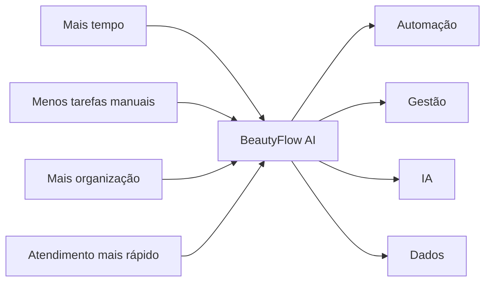

### O BeautyFlow busca entregar

- menos tarefas operacionais repetitivas;
- atendimento mais rápido;
- agenda organizada;
- comunicação padronizada;
- redução de esquecimentos;
- visão centralizada da operação;
- base para decisões orientadas por dados;
- estrutura preparada para evolução como SaaS.

---

## 05 // ARQUITETURA GERAL

O BeautyFlow possui hoje **duas grandes camadas**.

### Núcleo operacional

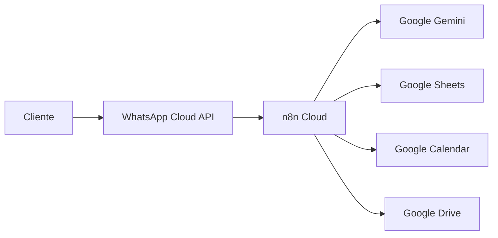

### BeautyFlow App

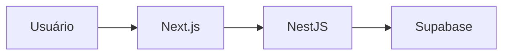

### Arquitetura alvo de integração

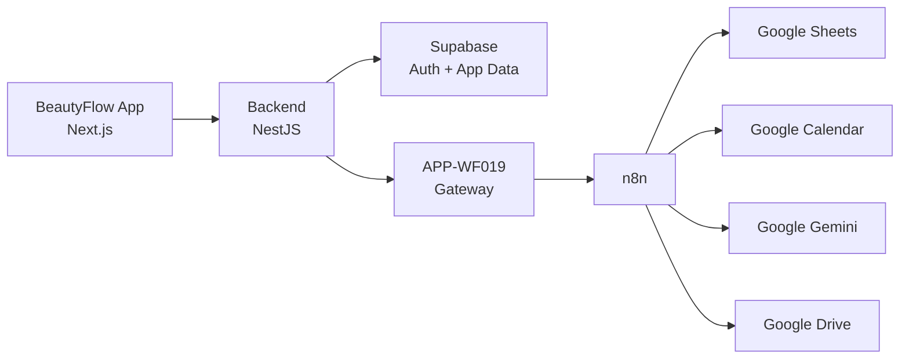

> O frontend não deve chamar os webhooks do n8n diretamente. O NestJS permanece como fronteira de autenticação, autorização, validação, auditoria e integração.

---

## 06 // FLUXO PRINCIPAL DO WHATSAPP

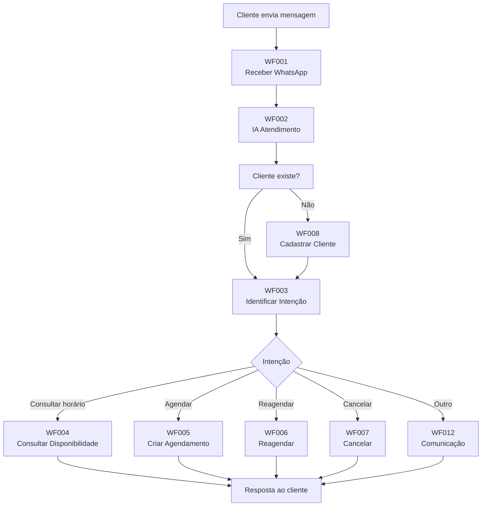

---

## 07 // MAPA DOS WORKFLOWS

| Domínio | Workflows | Responsabilidade |
|---|---|---|
| 💬 Atendimento | WF001–WF003 | Recepção, IA e intenção |
| 📅 Agenda | WF004–WF007 | Disponibilidade, agendamento, reagendamento e cancelamento |
| 👤 Clientes | WF008–WF009 | Cadastro e atualização |
| 💳 Financeiro | WF010–WF011 | Pagamentos e cobranças |
| 📣 Comunicação | WF012–WF015 | Mensagens, lembretes, pesquisa e follow-up |
| ⚙️ Administração | WF016–WF018 | Backup, logs e limpeza |

---

## 08 // VISÃO DOS 18 WORKFLOWS

```text
ATENDIMENTO
├── WF001 — Receber WhatsApp
├── WF002 — IA Atendimento
└── WF003 — Identificar Intenção

AGENDA
├── WF004 — Consultar Disponibilidade
├── WF005 — Criar Agendamento
├── WF006 — Reagendar
└── WF007 — Cancelar

CLIENTES
├── WF008 — Cadastrar Cliente
└── WF009 — Atualizar Cliente

FINANCEIRO
├── WF010 — Registrar Pagamento
└── WF011 — Cobrança

COMUNICAÇÃO
├── WF012 — Confirmação / Comunicação
├── WF013 — Lembrete
├── WF014 — Pesquisa de Satisfação
└── WF015 — Follow-up

ADMINISTRAÇÃO
├── WF016 — Backup
├── WF017 — Logs
└── WF018 — Limpeza
```

---

## 09 // BEAUTYFLOW APP

O BeautyFlow evoluiu de uma arquitetura focada apenas em automações para uma aplicação web completa.

### Módulos do App

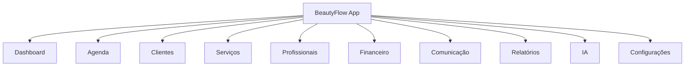

### Backend NestJS

```text
Auth
Agenda
Clientes
Serviços
Profissionais
Dashboard
Financeiro
Comunicação
Relatórios
Configurações
IA
```

---

## 10 // STACK TECNOLÓGICA

### Desenvolvimento


### Dados e autenticação


### IA e automação


### Engenharia


---

## 11 // MODELO DE DADOS OPERACIONAL

```text
EMPRESAS
PROFISSIONAIS
CLIENTES
SERVICOS
AGENDAMENTOS
PAGAMENTOS
COBRANCAS
MENSAGENS
IA_MEMORIA
DISPONIBILIDADES
AVALIACOES / PESQUISAS
FOLLOWUPS
LEMBRETES
LOGS
DOMINIOS
```

### Princípio multiempresa

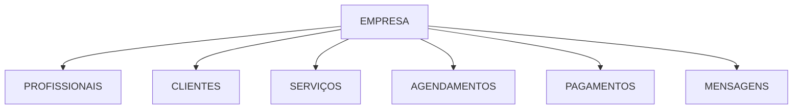

---

## 12 // SEGURANÇA E MULTI-TENANCY

O BeautyFlow App foi estruturado para que **segurança não dependa apenas da interface**.

### Princípios

- autenticação via Supabase;
- autorização efetiva no backend;
- resolução de empresa e usuário server-side;
- isolamento multiempresa;
- restrição por perfil;
- frontend sem acesso direto ao n8n;
- chaves privadas somente no servidor;
- prevenção de acesso cross-tenant;
- variáveis sensíveis fora do versionamento.

### Fluxo de autorização

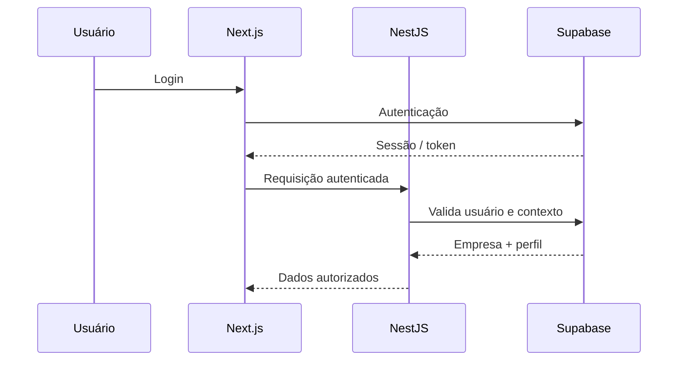

---

## 13 // CONTRATOS COMPARTILHADOS

O projeto utiliza `libs/shared-types/` para reduzir duplicação de contratos entre frontend e backend.

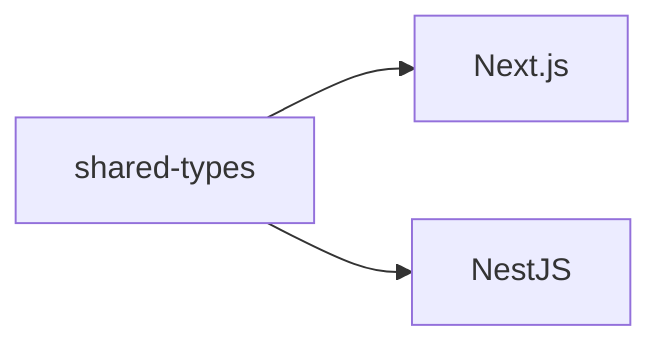

---

## 14 // RASTREABILIDADE

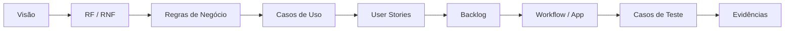

### Artefatos trabalhados

- requisitos funcionais;
- requisitos não funcionais;
- regras de negócio;
- casos de uso;
- user stories;
- critérios de aceite;
- arquitetura;
- casos de teste;
- evidências;
- matriz de rastreabilidade;
- documentação dos workflows.

---

## 15 // TESTES E QUALIDADE

```text
WF001 ↔ CT001
WF002 ↔ CT002
WF003 ↔ CT003
...
WF018 ↔ CT018
```

> Um arquivo JSON versionado não significa automaticamente que o workflow está validado.

A classificação de pronto deve considerar implementação, testes, evidências, regras de negócio, tratamento de erro, regressão e documentação.

---

## 16 // STATUS ATUAL

| Área | Status |
|---|---|
| WF001–WF018 | ✅ Versionados |
| Documentação n8n | ✅ Estruturada |
| Requisitos / regras / testes | ✅ Documentados |
| Frontend Next.js | ✅ Estruturado |
| Backend NestJS | ✅ Estruturado |
| Supabase Auth | ✅ Implementado |
| Dashboard | ✅ Implementado/estruturado |
| Agenda | ✅ Implementada/estruturada |
| Clientes | ✅ Implementado/estruturado |
| Serviços | ✅ Implementado/estruturado |
| Profissionais | ✅ Implementado/estruturado |
| Financeiro | ✅ Implementado/estruturado |
| Comunicação | ✅ Implementado/estruturado |
| Relatórios | ✅ Implementado/estruturado |
| IA | ✅ Implementado/estruturado |
| Configurações | ✅ Implementado/estruturado |
| APP-WF019 | 🔄 Próxima macroetapa |
| Dados reais no App | 🔄 Integração progressiva |
| Hardening para produção | 🟡 Pendente |
| Escala SaaS | 🟡 Evolução futura |

---

## 17 // O QUE AINDA NÃO ESTÁ CONCLUÍDO

- integração operacional completa do App com o n8n;
- implementação do `APP-WF019`;
- substituição progressiva de mocks;
- integração completa das telas aos dados reais;
- onboarding automatizado;
- evolução da observabilidade;
- hardening de segurança;
- testes de integração de ponta a ponta;
- preparação para produção em escala;
- refinamento de gaps funcionais conhecidos.

---

## 18 // ROADMAP

```mermaid
flowchart LR
    A["WF001-WF018"] --> B["BeautyFlow App"]
    B --> C["Supabase + Auth"]
    C --> D["Módulos do App"]
    D --> E["APP-WF019"]
    E --> F["Agenda com dados reais"]
    F --> G["Demais módulos"]
    G --> H["Testes E2E"]
    H --> I["Hardening"]
    I --> J["MVP Comercial"]
    J --> K["Escala SaaS"]
```

### Próximas prioridades

1. manter documentação e código sincronizados;
2. implementar `APP-WF019`;
3. usar Agenda como primeiro fluxo vertical real;
4. validar Frontend → Backend → n8n → dados;
5. substituir mocks gradualmente;
6. ampliar testes de integração;
7. fortalecer segurança e observabilidade;
8. criar ambiente de demonstração;
9. preparar MVP comercial.

---

## 19 // ESTRUTURA DO REPOSITÓRIO

```text
beautyflow-ai/
│
├── backend/                  # API NestJS
├── frontend/                 # BeautyFlow App em Next.js
├── libs/
│   └── shared-types/         # Contratos compartilhados
├── n8n/
│   ├── workflows/            # WF001-WF018
│   └── documentacao/         # Documentação técnica
├── docs/                     # Requisitos e arquitetura
├── tests/                    # Testes e rastreabilidade
├── database/
├── scripts/
├── CLAUDE.md
└── README.md
```

---

## 20 // COMO EXECUTAR

### Pré-requisitos

```text
Node.js 20+
npm 10+
```

### Instalação

```bash
npm install
```

### Frontend + Backend

```bash
npm run dev
```

### Somente frontend

```bash
npm run dev:frontend
```

### Somente backend

```bash
npm run dev:backend
```

### Build

```bash
npm run build
```

### Lint

```bash
npm run lint
```

### Testes

```bash
npm run test
```

### Endereços locais padrão

```text
Frontend → http://localhost:3000
Backend  → http://localhost:3001
```

---

## 21 // DIFERENCIAIS DO CASE

O BeautyFlow demonstra uma abordagem de **produto de ponta a ponta**:

```text
PROBLEMA
   ↓
DISCOVERY
   ↓
REQUISITOS
   ↓
REGRAS DE NEGÓCIO
   ↓
USER STORIES
   ↓
ARQUITETURA
   ↓
AUTOMAÇÃO
   ↓
BACKEND
   ↓
FRONTEND
   ↓
TESTES
   ↓
EVOLUÇÃO DO PRODUTO
```

### Competências demonstradas


---

## 22 // EVOLUÇÃO DO PRODUTO

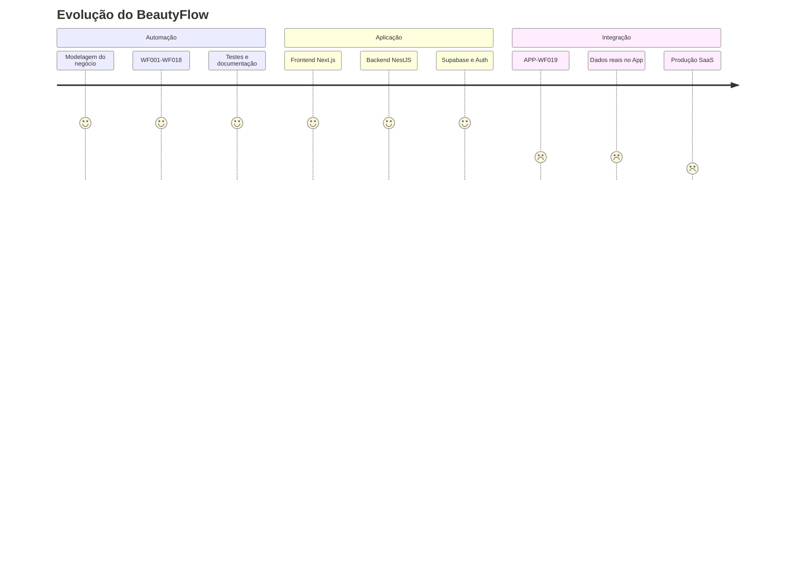

---

## 23 // PRINCÍPIOS DO PROJETO

```text
Entender o problema
        ↓
Modelar a regra
        ↓
Automatizar o processo
        ↓
Validar o comportamento
        ↓
Medir e aprender
        ↓
Evoluir o produto
```

---

## 24 // REPOSITÓRIO

<div align="center">

### GitHub

**[github.com/Kelencs/beautyflow-ai](https://github.com/Kelencs/beautyflow-ai)**

<br/>


</div>

---

## 25 // AUTORIA

<div align="center">

### Kelen Cristina

**Product Owner • Análise de Requisitos • Automação • IA • Dados**

<br/>

[](https://github.com/Kelencs)

<br/>

> **Entender. Planejar. Automatizar. Evoluir.**

</div>

---

<div align="center">

## ✦ BEAUTYFLOW AI

**Transformando processos manuais em experiências digitais inteligentes.**

`Product` • `Requirements` • `Automation` • `AI` • `Data` • `SaaS`

<br/>

© 2026 BeautyFlow AI

</div>
