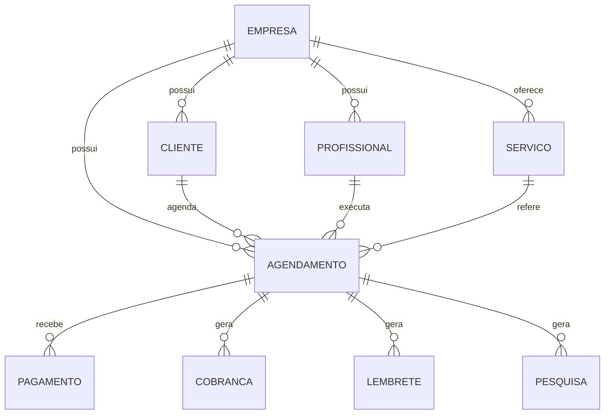

# Diagrama ER — Estado Híbrido

```mermaid
erDiagram
  EMPRESA ||--o{ CLIENTE : possui
  EMPRESA ||--o{ PROFISSIONAL : possui
  EMPRESA ||--o{ SERVICO : oferece
  EMPRESA ||--o{ AGENDAMENTO : possui
  CLIENTE ||--o{ AGENDAMENTO : agenda
  PROFISSIONAL ||--o{ AGENDAMENTO : executa
  SERVICO ||--o{ AGENDAMENTO : refere
  AGENDAMENTO ||--o{ PAGAMENTO : recebe
  AGENDAMENTO ||--o{ COBRANCA : gera
  AGENDAMENTO ||--o{ LEMBRETE : gera
  AGENDAMENTO ||--o{ PESQUISA : gera
```

As entidades acima são lógicas; a implementação operacional atual é Sheets.
