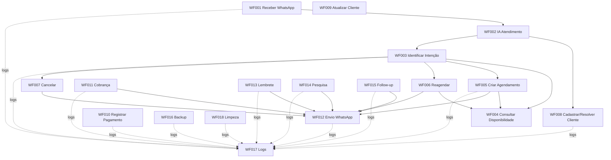

# BeautyFlow AI — Documentação dos Workflows n8n

Este diretório concentra a documentação técnica dos workflows **WF001 a WF018** do BeautyFlow.

## Estrutura

```text
n8n/
└── documentacao/
    ├── README.md
    ├── atendimento/
    │   ├── ATD-WF001-receber-whatsapp.md
    │   ├── ATD-WF002-ia-atendimento.md
    │   └── ATD-WF003-identificar-intencao.md
    ├── agenda/
    │   ├── AGE-WF004-consultar-disponibilidade.md
    │   ├── AGE-WF005-criar-agendamento.md
    │   ├── AGE-WF006-reagendar.md
    │   └── AGE-WF007-cancelar.md
    ├── clientes/
    │   ├── CLI-WF008-cadastrar-cliente.md
    │   └── CLI-WF009-atualizar-cliente.md
    ├── financeiro/
    │   ├── FIN-WF010-registrar-pagamento.md
    │   └── FIN-WF011-cobranca.md
    ├── comunicacao/
    │   ├── COM-WF012-confirmacao.md
    │   ├── COM-WF013-lembrete.md
    │   ├── COM-WF014-pesquisa.md
    │   └── COM-WF015-follow-up.md
    └── administracao/
        ├── ADM-WF016-backup.md
        ├── ADM-WF017-logs.md
        └── ADM-WF018-limpeza.md
```

## Catálogo

| Código | Domínio | Workflow | Documento |
|---|---|---|---|
| WF001 | Atendimento | Receber WhatsApp | `atendimento/ATD-WF001-receber-whatsapp.md` |
| WF002 | Atendimento | IA Atendimento | `atendimento/ATD-WF002-ia-atendimento.md` |
| WF003 | Atendimento | Identificar Intenção | `atendimento/ATD-WF003-identificar-intencao.md` |
| WF004 | Agenda | Consultar Disponibilidade | `agenda/AGE-WF004-consultar-disponibilidade.md` |
| WF005 | Agenda | Criar Agendamento | `agenda/AGE-WF005-criar-agendamento.md` |
| WF006 | Agenda | Reagendar | `agenda/AGE-WF006-reagendar.md` |
| WF007 | Agenda | Cancelar | `agenda/AGE-WF007-cancelar.md` |
| WF008 | Clientes | Cadastrar Cliente | `clientes/CLI-WF008-cadastrar-cliente.md` |
| WF009 | Clientes | Atualizar Cliente | `clientes/CLI-WF009-atualizar-cliente.md` |
| WF010 | Financeiro | Registrar Pagamento | `financeiro/FIN-WF010-registrar-pagamento.md` |
| WF011 | Financeiro | Cobrança | `financeiro/FIN-WF011-cobranca.md` |
| WF012 | Comunicação | Confirmação / Envio WhatsApp | `comunicacao/COM-WF012-confirmacao.md` |
| WF013 | Comunicação | Lembrete | `comunicacao/COM-WF013-lembrete.md` |
| WF014 | Comunicação | Pesquisa de Satisfação | `comunicacao/COM-WF014-pesquisa.md` |
| WF015 | Comunicação | Follow-up / Reativação | `comunicacao/COM-WF015-follow-up.md` |
| WF016 | Administração | Backup | `administracao/ADM-WF016-backup.md` |
| WF017 | Administração | Logs | `administracao/ADM-WF017-logs.md` |
| WF018 | Administração | Limpeza | `administracao/ADM-WF018-limpeza.md` |

## Arquitetura geral



## Padrões obrigatórios

- Toda operação operacional deve preservar `ID_EMPRESA`.
- O fluxo deve distinguir **resultado vazio legítimo**, **bloqueio por regra de negócio** e **erro técnico**.
- Erro de integração não pode ser mascarado como “não encontrado”.
- O WhatsApp deve ser centralizado no `COM-WF012` sempre que possível.
- Logs devem usar o `ADM-WF017`, com `workflow` e `node` de origem reais.
- Credenciais e tokens nunca devem ser commitados no Git.

## Observação importante sobre o WF002

O `ATD-WF002 — IA Atendimento` faz parte da arquitetura e é chamado pelo WF001, porém sua documentação deve ser reconciliada com o JSON exportado do n8n. Se o arquivo ainda não estiver em `n8n/workflows/atendimento/`, exporte o workflow atual e faça o versionamento antes de tratá-lo como fonte definitiva.

## Como adicionar ao Git

Copie a pasta `documentacao` deste pacote para dentro de `n8n/` no repositório e faça o commit:

```bash
git add n8n/documentacao
git commit -m "docs: documenta workflows WF001 a WF018"
git push
```

> Revisão da documentação: 18/08/2026.
